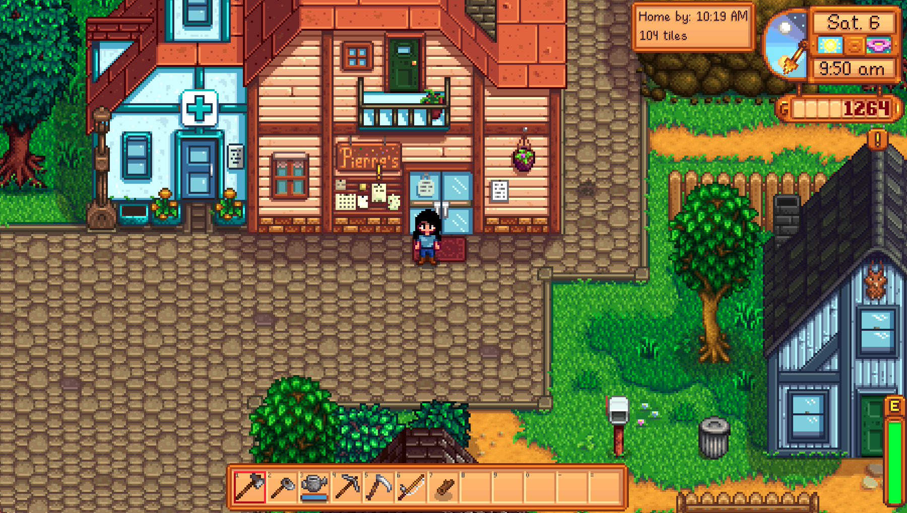

This repository contains my SMAPI mod for Stardew Valley.

# Time to Sleep

Stardew valley mod that estimates when you'll arrive home based on the shortest
possible walkable path from current location to your bed tile. 

## Features
- Calculates shortest routes using A* algorithm
- Supports route finding across multiple game locations
- Detects building/warp points dynamically 
- Estimates the arrival time based on user's current speed
- Displays the ETA as an in-game widget

## Screenshot

